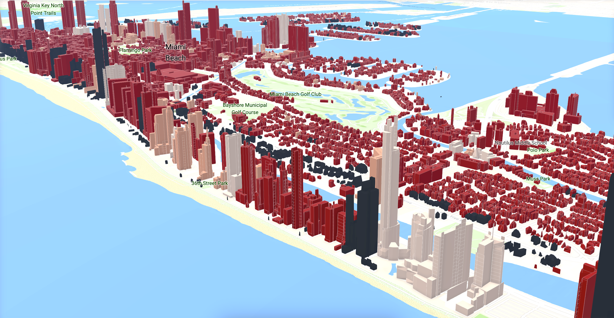
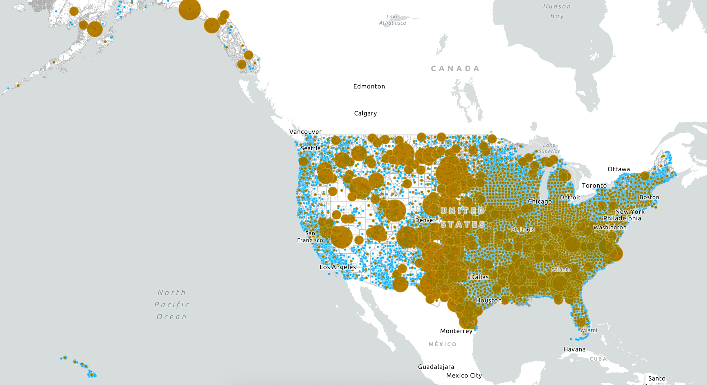

GIS Web

Overview
This is an interactive web-based platform showcasing geospatial projects, spatial analyses, and cartographic visualizations. The website demonstrates practical applications of Geographic Information Systems (GIS) and modern web mapping technologies.

The portfolio is designed to highlight and present spatial data processing, interactive visualization, and web deployment.

https://emilemiranda.github.io/

---

Objectives
- Present interactive geospatial projects in a web environment  
- Demonstrate proficiency in GIS tools and web mapping libraries  
- Showcase spatial analysis, cartography, and data storytelling  
- Provide accessible and user-friendly geospatial applications  

---

 Technologies & Tools

Frontend Development
- HTML5, CSS3, JavaScript  
- Bootstrap (responsive design)

Web Mapping Libraries
- Leaflet.js  
- Mapbox GL JS *(optional)*  
- OpenLayers *(optional)*  

GIS & Spatial Analysis
- QGIS  
- ArcGIS 

Data & Formats
- GeoJSON  
- Shapefiles  *(optional)*
- CSV  *(optional)*
- Raster datasets (GeoTIFF) *(optional)*

Deployment
- GitHub Pages  

---

Project Structure
project-folder/
│
├── index.html
├── resume.html
├── map.html
│
├── css/
│ ├── styles.css
│ └── resume.css
│
├── js/
│ ├── main.js
│ └── map.js
│
├── data/
│ ├── geojson/ # GeoJSON datasets
│ └── Shapfiles *(optional)*
│ └── CSV *(optional)*
│ └── raster/ *(optional)*
│
├── assets/
│ ├── images/ # Images and screenshots
│ └── icons/ # Icons and graphics
│
└── README.md

---

Featured Projects

Project 1: City of Miami Beach Sea Level Rise
Description:
This feature class has been created to illustrate the buildings planimetric in 2015. This layer was clipped to only include buildings within the City of Miami Beach boundary.  The process to create the buildings 3D models is explained in the ESRI doc.

Key Features:
- Interactive Web Scene map
- Spatial data visualization 
- User interaction (popups, filtering, toggles) 

Technologies Used:
ArcGIS

Live
https://www.arcgis.com/home/webscene/viewer.html?webscene=d9edbe52adae450693e33e7bb7190a80

---

Project 2: Fossil Exploration
Description:
Web map for fossil exploration, highlighting concentrations of ferrous, or iron-containing, minerals within a study area (Landsat image of Montana).

Key Features:
- Thematic mapping 
- Data-driven styling 
- Analytical outputs 

Technologies Used:
ArcGIS

Live
https://www.arcgis.com/apps/mapviewer/index.html?webmap=5b7c45a75d304cc1a375e395ea4682bf

---

Project 3: USA 2016 Daytime Population
Description:
This layer contains 2016 USA Daytime Population and Nighttime Population values for States, Counties, and Census Tracts. Daytime population refers to the population which works or resides in an areas during the day. Nighttime population (also known as Total Population) refers to the counts of population where people live. The map shows a comparison of these two counts, highlighting if the daytime or nighttime population is larger in an area.

Key Features:
- Raster or satellite data visualization 
- Spatial analysis results 
- Clean cartographic design 

Technologies Used:
ArcGIS

Live
https://www.arcgis.com/apps/mapviewer/index.html?webmap=ee296884a6154d839c87677cd9c1ead9
